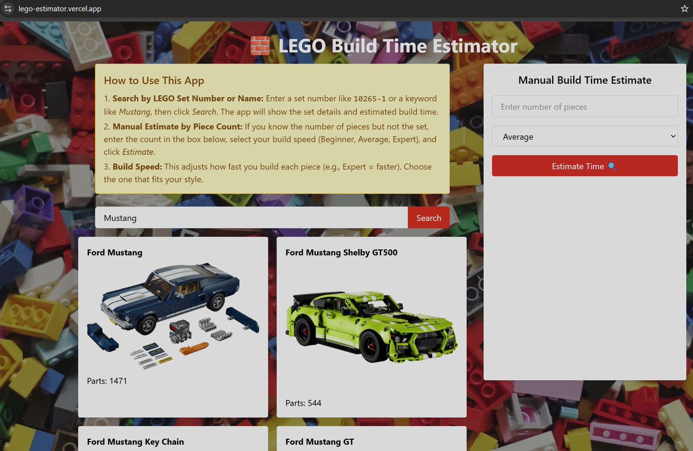

# 🧱 LEGO Build Time Estimator

Estimate how long it will take to build a LEGO set based on the number of pieces — either by searching real LEGO sets or manually entering a number.



---

## 🔍 Features

- 🔎 Search official LEGO sets by name or number (via Rebrickable API)
- ⏱ Estimate build time based on part count and your build skill
- 🎮 Beginner, Average, and Expert build time levels
- 🧩 Manual mode: estimate time by entering piece count yourself
- 🎨 LEGO-themed UI with background and interactive cards

---

## 🚀 Live Demo

🌐 [View the App](https://lego-estimator.vercel.app/)  
> Replace this with your actual Vercel URL.

---

## 📦 Getting Started with Create React App

This project was bootstrapped with [Create React App](https://github.com/facebook/create-react-app).

### Available Scripts

In the project directory, you can run:

#### `npm start`
Runs the app in the development mode.  
Open [http://localhost:3000](http://localhost:3000) to view it in your browser.  
The page will reload when you make changes. You may also see any lint errors in the console.

#### `npm test`
Launches the test runner in the interactive watch mode.  
See the section about [running tests](https://facebook.github.io/create-react-app/docs/running-tests) for more information.

#### `npm run build`
Builds the app for production to the `build` folder.  
It correctly bundles React in production mode and optimizes the build for the best performance.  
The build is minified and the filenames include the hashes.  
Your app is ready to be deployed!  
See the section about [deployment](https://facebook.github.io/create-react-app/docs/deployment) for more information.

#### `npm run eject`
**Note: this is a one-way operation. Once you eject, you can’t go back!**  
This command removes the single build dependency from your project.

---

## 🧠 Build Time Logic

Estimated time = `number of pieces × minutes per piece`, where:

| Skill Level | Minutes per piece |
|-------------|-------------------|
| Beginner    | 2                 |
| Average     | 1                 |
| Expert      | 0.5               |

---

## 🛠 Tech Stack

- React
- Tailwind CSS
- Axios
- Rebrickable API
- Vercel (deployment)

---

## 🔐 Environment Variables

Create a `.env` file and add your Rebrickable API key:

```env
REACT_APP_REBRICKABLE_API_KEY=your_api_key_here
